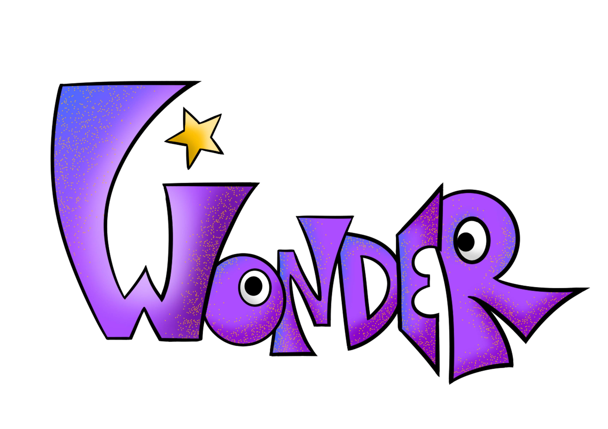

# Wonder

  

<h3 align="center">Development of a Gamified Web Platform for Educational Environments</h3>
<h4 align="center"><i>Final Degree Project</i></h4>

## Author

<table align="center">
  <tr>
    <td align="center">
      <a href="https://github.com/AnaPB8">
         
        <strong>Ana Pérez Bango</strong>
      </a> 
      <a href="mailto:UO294100@uniovi.es">UO294100@uniovi.es</a>
    </td>
  </tr>
</table>

## What is Wonder?

Wonder is a gamified web platform for educational environments designed to support both students and teachers alike. Its main objective is to create a pedagocical support tool that meets a set of functional and usability requirements. 

The platform provides different functionalities for its users depending on their role, which include activity participation, progress tracking, and result management, among others.

